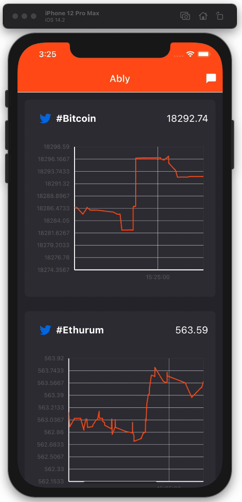
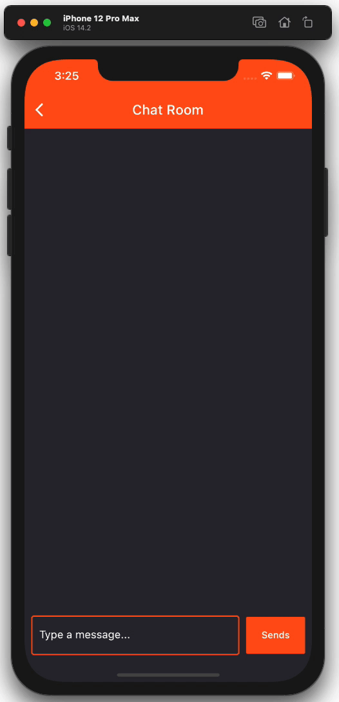

# Ably Flutter SDK Demo App

This is a FinTech sample application that uses [Coindesk](https://www.ably.io/hub/ably-coindesk/bitcoin) Hub provided by [Ably](https://www.ably.io) to read cryptocurrency price changes on real-time.

The app has the following features:
1. Dashboard with real-time graphs for cryptocurrencies prices.
2. Public chat room.
3. Clicking on a currency name will bring up recent tweets on its hashtag.

## Getting Started

This project is a real example on how to use the [Ably Flutter SDK](https://pub.dev/packages/ably_flutter_plugin). To get started:
1. [Signup](https://www.ably.io) to get your Ably API Key.
2. Subscribe to [Cryptocurrency hub](https://www.ably.io/hub/ably-coindesk/crypto-pricing), note that if you didn't do this step, you won't receive data even with the API Key.
3. Sing-up for a [Twitter Developer account](https://developer.twitter.com), note that you won't be able to see any tweets if you don't have valid keys for Twitter's API.
4. Clone the project.
5. Make sure you have installed Flutter on your machine.
6. Run `flutter pub get` in the project directory.
7. Add your keys to [config_example.dart](lib/config_example.dart), and change its name to `config.dart`.
8. For Android, the `minSdkVersion`  in `app/src/build.gradle` has to be set to `24` as required by Ably's Flutter SDK.
9. Run the app.

For help getting started with Flutter, visit the
[online documentation](https://flutter.dev/docs), which offers tutorials,
samples, guidance on mobile development, and a full API reference.

## App Screenshots
  
